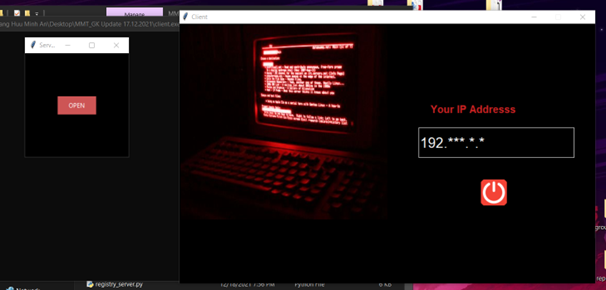
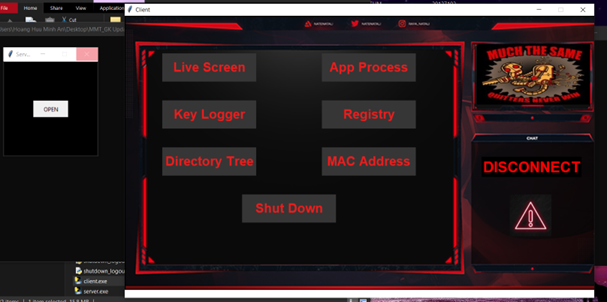

# 🔥Remote Control Application - Computer Networking
TCP/IPv4. Remote control application program allows users to control their computers in the same network. The connection between the server (server) and the user (client) is through the IPV4 address and the fixed port, the user must log in with the IPV4 address of the machine that they want to control with the file server enabled. .exe. After successfully connecting the program, the user can manipulate the commands on the GUI screen of the application, the server will catch the message and will perform the operation and send it to the client. Specifically, the program has provided the following functions: Live screen, Key logger, Directory tree, App process, Registry, MAC address, ShutDown

## 🍀 Member:
1. Hoàng Hữu Minh An   ID: 20127102
2. Lê Phan Duy Tùng   ID: 20127661
3. Thái Văn Thiên    ID: 20127631

## 💻 UI

- Login

## 📌 Function:
- Live Screen: the user clicks on the live screen button in the main interface, the program will switch to the interface of the live screen function, including the image of the current screen on the server and below are the Back and Save buttons. And the image displayed on the screen will always be updated continuously thanks to the extremely fast process of capturing and sending data back and forth from both the server and the client.

- Key logger: user clicks the keylogger button in the main interface, the program will switch to the interface of the keylogger feature including 1 textbox to display a list of captured keys and function buttons: HOOK, PRINT, DELETE, LOCK and BACK.

- Directory tree: clicks on the Directory tree button on the main interface, the program will automatically switch to the interface of the directory tree function, we will see the treeview

- App Process: clicks the App Process button in the main interface, the program will automatically switch to the interface of the app process function, here they will have a treeview and 6 buttons respectively process, list, start, kill, clear, back

- Registry: click the Registry button in the main interface, the program will automatically switch to the interface of the registry function, we will see 4 text boxes used to enter the key, Name value, Data Value, Data Type, used to enter in turn the information

- MAC address: only need to press the MAC address button at the console

- ShutDown: clicks on the shutdown / logout button in the main interface, a window will appear with 2 buttons SHUTDOWN and LOGOUT

## Link Demo

